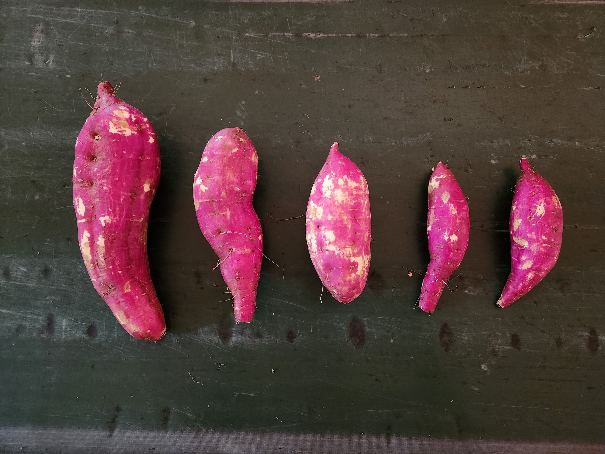
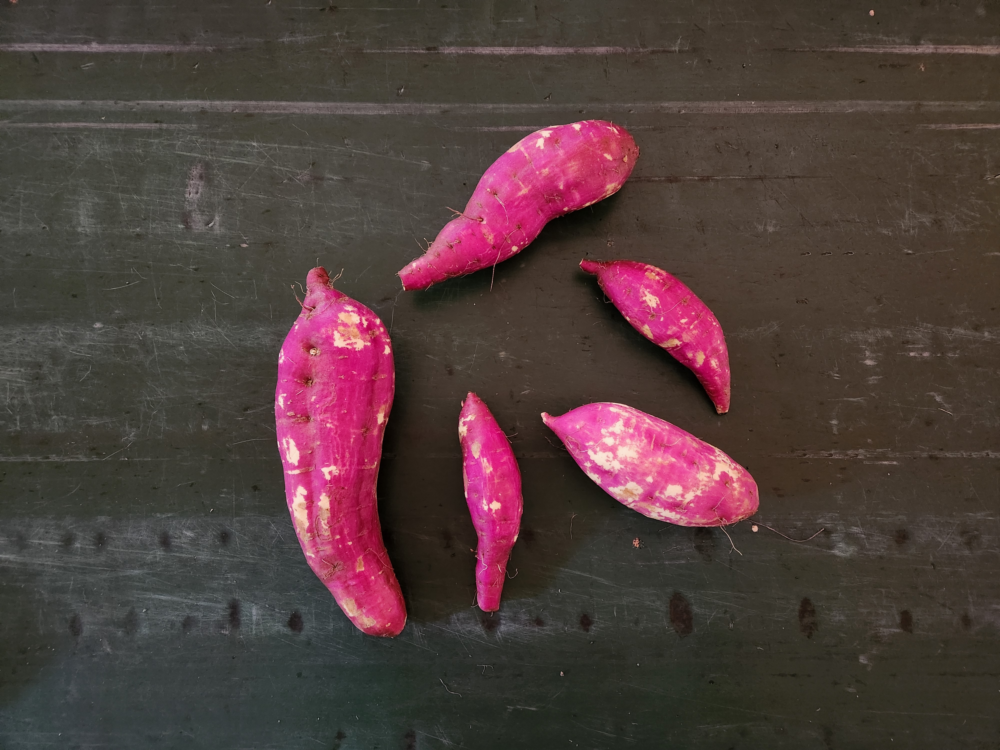
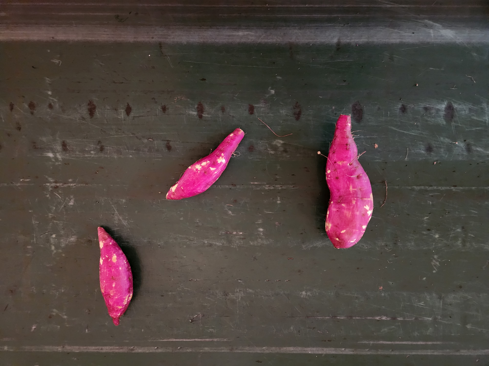
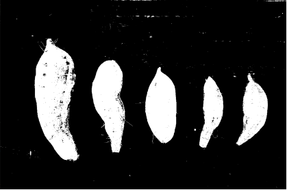
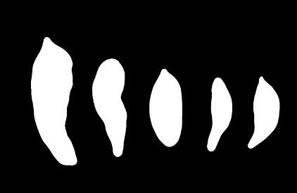
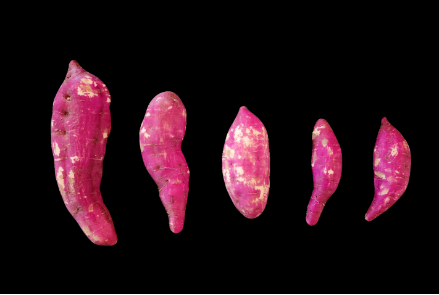
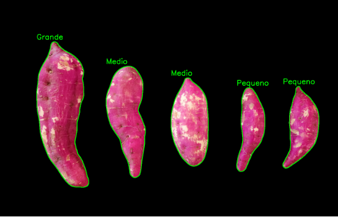
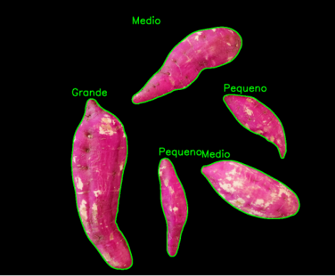
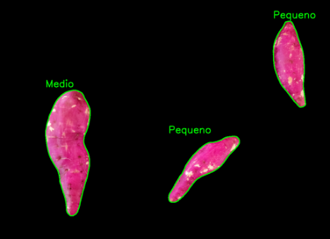

### CLASSIFICAÇÃO DE BATATAS USANDO PROCESSAMENTO DIGITAL DE IMAGENS

#### 1. INTRODUÇÃO
Este relatório descreve a criação de um sistema de classificação de batatas doces com base em suas áreas. O objetivo principal é categorizar objetos como "Pequeno", "Médio" ou "Grande". O processo inclui a segmentação dos objetos por meio de técnicas de processamento de imagem, seguido pela identificação de contornos para extrair informações cruciais, como área e localização.

A classificação é realizada usando limiares de área ajustáveis, distinguindo entre diferentes tamanhos delas. Essa abordagem flexível permite a adaptação do sistema a várias situações sendo possível configurar o programa para outras culturas. Os resultados são visualizados na imagem original, onde cada objeto é contornado e rotulado com sua respectiva classe.

O uso de processamento de imagem é imprescindível para a classificação de certas culturas como a batata doce presente neste relatório, isso se deve pela característica física irregular dela, impossibilitando a classificação somente usando mecanismos mecânicos. 	

O relatório abordará detalhes técnicos da implementação do processamento digital sem abordar a implementação mecânica contendo os atuadores do sistema que usariam o comando gerado pelo programa.

#### 2. O PROBLEMA

Para o desenvolvimento do código inicialmente utilizadas três imagens como referência para o programa, elas foram tiradas a uma distância de 50cm para padronizar a perspectiva delas.



A primeira imagem pro exemplo exemplo, temos 5 batatas doces onde temos 1 que pode ser classificada com grande, 2 médias e 2 pequenas respectivamente.

Temos as mesmas também em disposições diferentes para testar o programa em diferentes situações.



#### 3. DESENVOLVIMENTO

O projeto foi desenvolvido em Python usando as bibliotecas *Numpy*, *OpenCV* e *Skimage*, primeiro foi carregada a imagem e feito o redimensionamento devido ser tirada com uma resolução muito alta, após isso foi convertida para o espaço de cores HSV.

Então após uma análise foi constatado que as batatas doces possuem um intervalo de cores entre *lower* e *upper* definidos no código abaixo, com isso foi criado uma máscara para separar este intervalo de cor da imagem original.

```python
# Define o intervalo de cores da mascara
lower = np.array([0, 20, 120])
upper = np.array([180, 230, 255])
# Define a mascara
mask = cv2.inRange(hsv, lower, upper)
```



Como visto acima a máscara gerada tem a presença de muito ruído, para isto será utilizado um filtro de mediana com raio 20 retirando todo o ruído resultando em uma máscara somente com as batatas doces.


`	`Agora com a máscara gerada vamos separar as batatas da imagem original com a operação *and* bit a bit gerando a figura 6.

```python
# Bitwise-AND entre a máscara e a imagem original
res = cv2.bitwise\_and(frame, frame, mask=mask)
cv2.imshow('Batatas separadas', res)
```


Com isso vamos calcular a área das batatas presentes na imagem, primeiro foi feito o contorno delas e depois calculado a área deste contorno, após testes, foi constatado que batatas com menos 30000 pixels quadrados são pequenas, até 60000 são médias e acima disso grandes. 

Os dados obtidos são guardados na variável *objetos\_info* onde possui a informação de classificação, área e localização. Para fins visuais foi gerado também uma imagem com o contorno e tipo de batata. 

#### 4. RESULTADOS

Temos o seguinte resultado com o código:



```
Objeto 1 - Classificacao: Pequeno, Area: 24271.0 pixels quadrados, Localizacao: (999, 393, 118, 347)
Objeto 2 - Classificacao: Pequeno, Area: 28974.5 pixels quadrados, Localizacao: (1190, 387, 150, 339)
Objeto 3 - Classificacao: Medio, Area: 42648.5 pixels quadrados, Localizacao: (728, 352, 155, 366)
Objeto 4 - Classificacao: Medio, Area: 48655.0 pixels quadrados, Localizacao: (460, 304, 163, 461)
Objeto 5 - Classificacao: Grande, Area: 84497.0 pixels quadrados, Localizacao: (173, 203, 216, 602)
```

Através da imagem vemos que temos um resultado correto comparando com as expectativas apresentada no tópico 2. Também temos a localização da batata, ela é definida por **(Posição no eixo X da imagem, Posição no eixo Y da imagem, Largura da localização, Altura da localização)**, com essas informações seria possível projetar algum mecanismo para a separação da mesma.

Em seguida, aplicando o programa nas demais imagens exemplo a fim de validar seu funcionamento:



```
Objeto 1 - Classificacao: Pequeno, Area: 24271.0 pixels quadrados, Localizacao: (999, 393, 118, 347)
Objeto 2 - Classificacao: Pequeno, Area: 28974.5 pixels quadrados, Localizacao: (1190, 387, 150, 339)
Objeto 3 - Classificacao: Medio, Area: 42648.5 pixels quadrados, Localizacao: (728, 352, 155, 366)
Objeto 4 - Classificacao: Medio, Area: 48655.0 pixels quadrados, Localizacao: (460, 304, 163, 461)
Objeto 5 - Classificacao: Grande, Area: 84497.0 pixels quadrados, Localizacao: (173, 203, 216, 602)
```



```
Objeto 1 - Classificacao: Pequeno, Area: 15881.0 pixels quadrados, Localizacao: (724, 490, 222, 206)
Objeto 2 - Classificacao: Medio, Area: 36277.0 pixels quadrados, Localizacao: (341, 347, 140, 391)
Objeto 3 - Classificacao: Pequeno, Area: 17874.0 pixels quadrados, Localizacao: (1050, 133, 102, 268)
```

#### 5. CONCLUSÕES

O desenvolvimento e implementação do sistema de classificação de batatas doces com base em áreas proporcionaram uma solução eficaz para categorizar em "Pequeno", "Médio" ou "Grande" com imagens. Ao longo deste projeto, foi explorado diversas técnicas de processamento de imagem, desde a segmentação por cores até a identificação de contornos, com o intuito de extrair informações cruciais para a classificação.

Os resultados obtidos demonstram a capacidade do sistema em distinguir e rotular objetos com base em suas áreas, oferecendo uma visão prática de sua eficácia. As imagens geradas, destacando contornos e etiquetas de classificação, proporcionam uma visualização clara do processo de classificação em ação.

Durante o desenvolvimento, foi ajustado diferentes parâmetros, considerando o exemplo apresentado. A flexibilidade do sistema em relação aos limiares de área permite sua adaptação tornando-a uma ferramenta versátil, pois facilmente poderia ser empregada para o uso com outros tipos de culturas.

Contudo, reconhecemos que, como qualquer sistema, existem limitações, havendo espaço para melhorias futuras, como a otimização de algoritmos e a exploração de técnicas mais avançadas de aprendizado de máquina e também falta a implementação mecânica do sistema que não foi abordada neste projeto.

Em conclusão, este projeto oferece uma solução prática e eficiente para a classificação de culturas com o uso de imagens, com potenciais aplicações em diversos setores. 